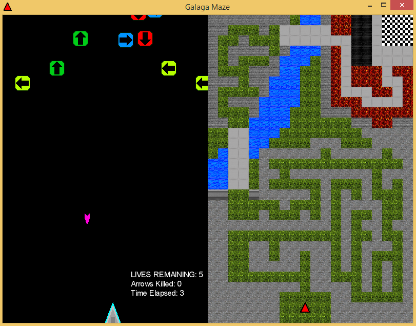
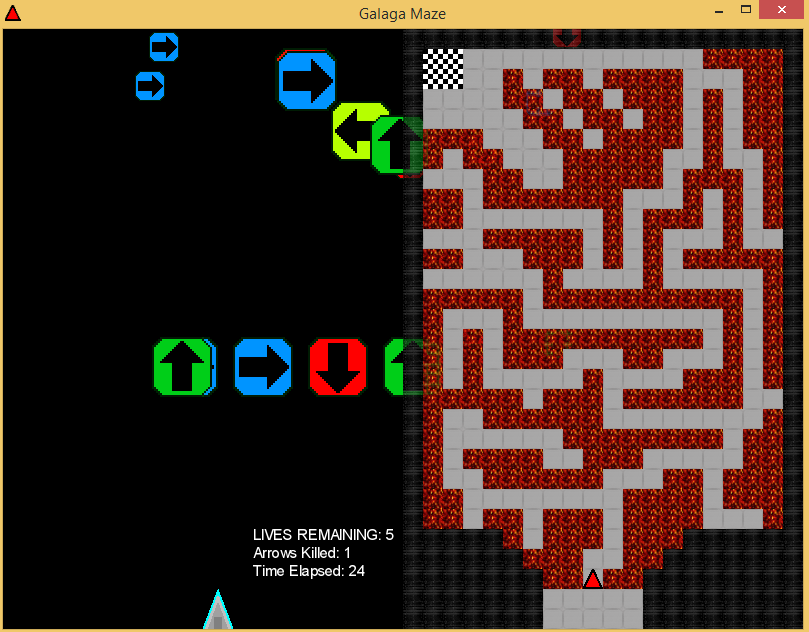

# shootermaze
I made this game for the game jam event Ludum Dare 41 (under the alias "pohead12345")

The theme was "Combine two incompatible genres".

I programmed everything using the [LibGDX](https://libgdx.com/) library and composed the music using [Beepbox](https://www.beepbox.co).

Competition entry: https://ldjam.com/events/ludum-dare/41/galagamaze

## Screenshots

